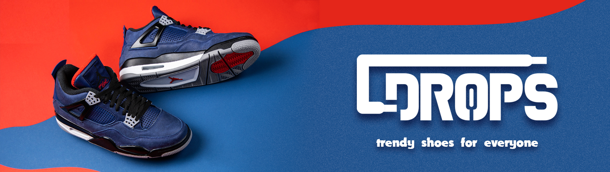

    
    <h2 style="font-size: 2.5em; padding: 20px 0">La mejor tienda de Zapatillas</h2>

    

        Aquí encontrarás un ecommerce de zapatillas totalmente a la moda en un diseño simple, intuitivo y elegante en el cual puedes navegar incluso desde tu móvil, tableta o computadora de escritorio, tu decides.
          
        Está desarrollado con tecnologías tales como NodeJS, React, Express, Sequelize para el Back y Boostrap, Material UI y CSS puro para el Front, por citar algunas.
          
        Cuenta con una pasarela de pago através de Mercado Pago y un panel de administración que te permitirá monitorear todo lo referente al sitio, desde estadísticas de ventas
        por mes, hasta usuario y roles dentro la misma.
          
    

